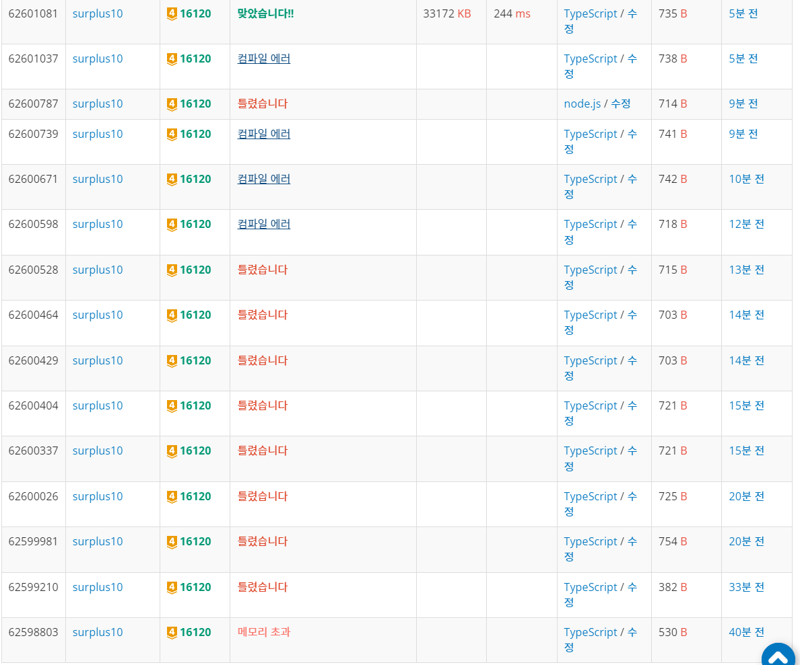

# 16120 PPAP

```typescript
const path = require("path");
const filePath =
  process.platform === "linux"
    ? "/dev/stdin"
    : path.join(__dirname, "/input.txt");
const input = require("fs")
  .readFileSync(filePath)
  .toString()
  .trim()
  .split("\n")
  .map((s: string) => s.replace("\r", ""));

let s: string = input[0];

while (s != "P") {
  if (s.includes("PPAP")) {
    s = s.replace("PPAP", "P");
  } else {
    break;
  }
}

console.log(s == "P" ? "PPAP" : "NP");
```

메모리초과 뜸.



```typescript
const path = require("path");
const filePath =
  process.platform === "linux"
    ? "/dev/stdin"
    : path.join(__dirname, "/input.txt");
const input = require("fs")
  .readFileSync(filePath)
  .toString()
  .trim()
  .split("\n")
  .map((s: string) => s.replace("\r", ""));

// let N = Number(input[0]);
// let [N, M] = input[0].split(" ").map(Number);

let str: string = input[0];

let stack: boolean[] = [];

for (let i = 0; i < str.length; i++) {
  stack.push(str[i] === "P");

  if (
    stack[stack.length - 1] &&
    !stack[stack.length - 2] &&
    stack[stack.length - 3] &&
    stack[stack.length - 4]
  ) {
    stack.pop();
    stack.pop();
    stack.pop();
  }
}

console.log(stack.length == 1 && stack[0] ? "PPAP" : "NP");
```

오류 원인 1.  
stack.length == 1 를 조건에 포함시키지 않았었음.

오류 원인 2.  
input 을 string으로 받으면 str[i] 로 접근이 가능하고 str.at(i) 사용시 컴파일 에러 발생.

input 을 any 로 받으면 str.at(i) 사용 가능.
