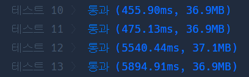
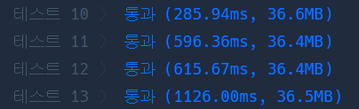

# 줄 서는 방법

첫 구현

```javascript
function solution(n, k) {
  let count = 0;
  let visited = new Array(n).fill(false);

  let answer = [];
  let arr = [];
  function waiting(depth) {
    if (depth === n) {
      if (++count == k) {
        answer = arr.filter(() => true);
      }
    }

    for (let i = 0; i < n; i++) {
      if (!visited[i]) {
        arr.push(i + 1);
        visited[i] = true;
        waiting(depth + 1);
        visited[i] = false;
        arr.pop(i - 1);
      }
    }
  }

  waiting(0);
  return answer;
}
```

재귀적으로 구현.

정확성을 맞으나 효율성에서 실패.



```javascript
function factorial(n) {
  let result = 1;
  for (var i = 2; i <= n; i++) result *= i;
  return result;
}

function solution(n, k) {
  let count = 0;
  let visited = new Array(n).fill(false);
  let answer = [];
  let arr = [];

  let isEnd = false;
  let f = factorial(n);
  let kPos = k / factorial;
  let begin = 0;
  let end = n;
  let inc = 1;

  if (kPos > 0.5) {
    k = f - k + 1;
    begin = n - 1;
    end = 0;
    inc = -1;
  }

  function waiting(depth) {
    if (isEnd) return;
    if (depth === n) {
      if (++count == k) {
        answer = arr.filter(() => true);
        isEnd = true;
      }
      return;
    }
    for (let i = begin; kPos > 0.5 ? i >= end : i < end; i += inc) {
      if (!visited[i]) {
        arr.push(i + 1);
        visited[i] = true;
        waiting(depth + 1);
        visited[i] = false;
        arr.pop(i - 1);
      }
    }
  }

  waiting(0);
  return answer;
}
```

종료조건을 추가해주고, factorial 을 구해 k/factorial 이 0.5보다 크면 반대로 순서를 구함.  
이론상 1/2 - 팩토리얼 구하는 시간 + (0.5 - k/factorial) 만큼 단축



그래도 효율성 테스트 통과하지 않음.

모든 순열을 구하지말고 규칙을 찾아보자.

n이 4면 factorial(4) = 24, 이하 f라고 지칭.

k가 1 ~ 6 이면 앞자리가 1,  
k가 7 ~ 12 이면 앞자리가 2,  
k가 13 ~ 18 이면 앞자리가 3,  
k가 19 ~ 24 이면 앞자리가 4.

몫을 더 쉽게 구하기 위에 k-1을 먼저 적용 해 주자.

f(n) / n 이 범위가 됨.

n 을 1 빼고 다시 범위 구하고 반복.

k가 1 ~ 6 에서 다시 2에 대해 몫을 구하면

1 ~ 2 이면 앞자리가 1,  
3 ~ 4 이면 앞자리가 2,  
5 ~ 6 이면 앞자리가 3,

1 2 3 4 는 숫자 그 자체가 아니라 순서가 된다.

예 (1, 2, 3, 4)

앞자리가 2이면 남은 수는 1, 3, 4

이때 3 ~ 4 에 해당해 앞자리가 2면 그 수는 3.

2 3 x x 가 됨.

```javascript
function factorial(n) {
  let result = 1;
  for (var i = 2; i <= n; i++) result *= i;
  return result;
}

function solution(n, k) {
  k -= 1;
  let answer = [];
  let arr = [];
  let depth = 0;
  let f = factorial(n);

  let candidate = [];

  for (let i = 0; i < n; i++) {
    candidate.push(i + 1);
  }

  // depth 는 단계
  // arr 은 단계별 몫
  while (depth != n - 1) {
    f /= n - depth;
    arr.push(Math.floor(k / f));
    k = k % f;
    depth++;
  }

  for (let i = 0; i < arr.length; i++) {
    answer.push(candidate.splice(arr[i], 1)[0]);
  }
  answer.push(candidate[0]);

  return answer;
}
```
