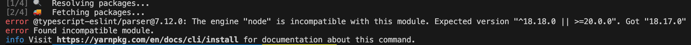
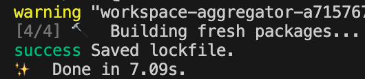
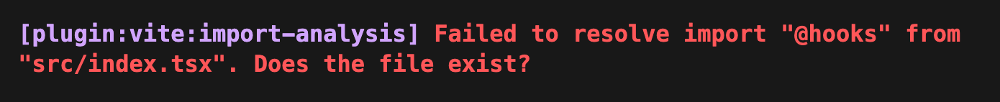
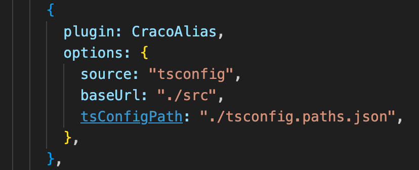
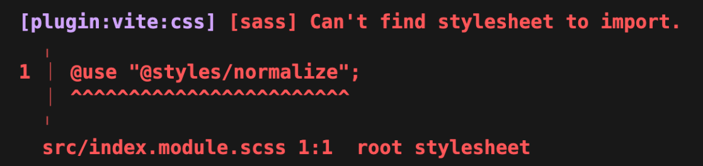
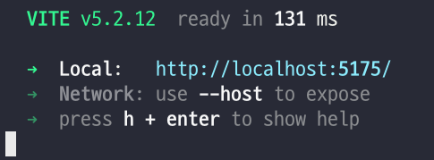
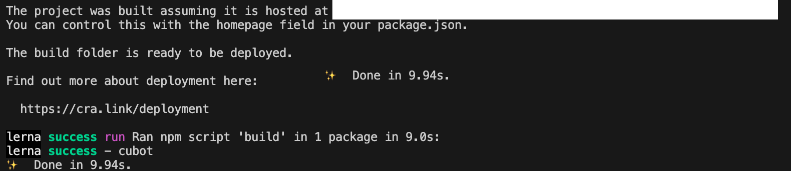

# Webpack -> Vite Migration

## 1. 설치하기

기존 프로젝트에 Vite 와 @vitejs/plugin-react 를 설치해 주는 것과, 새로운 Vite Project를 생성해 src를 옮기는 방법 두가지가 존재한다.

둘 중 어느것을 선택해도 딱히 차이는 없다고 한다.

## 2. 설정하기

기본적인 설정 파일을들 옮겨줘야 한다.

tsconfig, eslint, prettier 등 기존의 설정에 맞게 바꿔 주자.

webpack 기반의 craco 를 사용하고 있었기에, craco.config.js 를 vite.config.ts에 옮겨 주었다.

package.json을 옮기는 과정에서 설치한 Vite의 버전에 맞게 React버전도 변경해 주었다.

버전 설치후 package-lock (혹은 yarn.lock) 을 삭제후 재설치 해 주자.(새로운 프로젝트로 옮기는 경우 해당안됨)



노드 버전이 호환되지 않는다는 오류가 떴는데, nvm 을 사용중이었기에 쉽게 해결할 수 있었다.



설치가 성공적으로 완료되었다.

## 3. 진입점 수정

CRA를 통해 생성되었음으로 Vite 와의 진입점이 다른데, index.html 의 위치와 루트 컴포넌트의 이름이 다르다.

Vite는 src/main.tsx, CRA는 src/index.tsx 이고, Vite에 맞게 수정을 해 주었다.

새로운 vite 프로젝트의 index.html을 루트폴더에 복사했고,

```ts
<!doctype html>
<html lang="en">
  <head>
    <meta charset="UTF-8" />
    <link rel="icon" type="image/svg+xml" href="/vite.svg" />
    <meta name="viewport" content="width=device-width, initial-scale=1.0" />
    <title>Vite + React + TS</title>
  </head>
  <body>
    <div id="root"></div>
    // script tag의 src를 기존의 src/index.tsx 로 변경하자.
    <script type="module" src="/src/main.tsx"></script>
  </body>
</html>

```

src를 기존의 진입점 주소로 변경해 주었다.

이제, 실행 해 보자.

## 4. 오류 해결하기



@로 시작하는 경로를 인식하지 못하는데, craco가 webpack 기반이므로 craco alias 를 통해 tsconfig.path에 설정해준 경로들을 제대로 인식하지 못한 것으로 보인다.

경로 설정은 craco config에서 cracoAlias 라는 플러그인을 통해 이루어지는데, 이 부분이 vite에서 동작하도록 해 주어야 한다.



vite-tsconfig-paths 를 설치하고, vite.config.ts 에 플러그인을 추가 해 주자.

```ts
import { defineConfig } from "vite";
import react from "@vitejs/plugin-react";
import tsconfigPaths from "vite-tsconfig-paths";

// https://vitejs.dev/config/
export default defineConfig({
  plugins: [react(), tsconfigPaths()],
});
```

적용한 후 다시 실행하면 ?



또 경로 관련해서 오류가 발생했다.

위에서 설치한 플러그인이 scss 에서만 불러오지 못하는 듯 하다.

vite.config.ts 내부에 직접 alias 를 지정해 주면 인식이 가능해져 해당 방법을 선택하게 되었다.

tsconfig.path와 config의 alias를 둘다 쓰는것은 일관적이지 못하므로 (경로가 여러곳에서 관리되므로) vite.config.ts에서 alias로 관리하도록 하자.

```ts
Uncaught ReferenceError: process is not defined
```

기존의 환경변수를 인식하지 못하는데, 접두사를 수정해 주어야 한다.

또한 process.env 로 접근하는 것이 아닌 import.meta.env로 접근해야 한다.

- process.env -> import.meta.env
- REACT_APP -> VITE

## 6. 마무리

이제 사용하지 않을 CRA 패키지들을 삭제해 주자.

```
npm uninstall react-scripts
npm uninstall @craco/craco
npm uninstall craco-alias
```

Webpack -> Vite Migration 이 성공적으로 완료되었다.



dev와 build 모두 문제없이 동작한다.

- 기존 빌드속도  
  

- 새 빌드속도  
  

기존에는 M1 Pro 기준 약 10초가 소요되었는데, Migration 이후 약 1.6초가 걸려 빌드 속도가 월등히 빨라진 것을 확인할 수 있었다.
