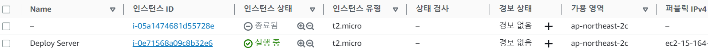

# Next JS APP CI/CD 환경 구축

## 1. EC2 인스턴스 생성, 셋팅



식별용 태그 확인.


nvm 을 사용해 nodejs, yarn, pm2 설치

```bash
$ sudo apt update

# nvm 설치하기.
# 최신버전은 https://github.com/nvm-sh/nvm 에서 확인
$ curl -o- https://raw.githubusercontent.com/nvm-sh/nvm/v0.39.3/install.sh | bash

# nvm 활성화.
$ . ~/.nvm/nvm.sh

# nvm 버전 확인.
$ nvm --version

# node 최신 lts 버전을 설치.
$ nvm install --lts

# yarn 설치
$ curl -sS https://dl.yarnpkg.com/debian/pubkey.gpg | sudo apt-key add -
echo "deb https://dl.yarnpkg.com/debian/ stable main" | sudo tee /etc/apt/sources.list.d/yarn.list
$ sudo apt update
$ sudo apt install yarn

# pm2 설치
$ sudo yarn global add pm2

# deploy 위치에서 pm2 시작(프로젝트 파일 있어야 함).
$ pm2 --name next start npm -- start

```

# CodeDeploy 에이전트 설치.

# [공식문서](https://docs.aws.amazon.com/ko_kr/codedeploy/latest/userguide/codedeploy-agent-operations-install-ubuntu.html)

```bash
$ sudo apt install ruby-full
$ sudo apt install wget
$ cd /home/ubuntu
$ wget https://aws-codedeploy-ap-northeast-2.s3.ap-northeast-2.amazonaws.com/latest/install
$ chmod +x ./install
$ sudo ./install auto > /tmp/logfile

# 잘 설치됐는지 확인하기
$ sudo service codedeploy-agent status
```

도메인 연결시 IP주소 고정 (탄력적IP) 필

## 2. EC2 인스턴스에 IAM 역할 적용


권한 2개 AWSCodeDeployFullAccess, AmazonS3FullAccess 추가.


이후 인스턴스 페이지에서 역할 적

## 3. IAM 사용자 추가


자동 생성된 암호 사용.


직접 정책 연결 → AWSCodeDeployFullAccess, AmazonS3FullAccess 추가.

## 4. 엑세스 키 생성

IAM 사용자 → 보안 자격 증명 → 엑세스 키 만들기


AWS 외부에서 실행되는 애플리케이션 선택 후 완료. csv 파일로 저장

## 5. 깃허브에 키 등록


## 6. CodeDeploy 용 IAM 역할 추가


AWSCodeDeployRole 확인

## 7. CodeDeploy 애플리케이션 생성 후 배포그룹 생성

배포그룹 생성시 아까 만들어준 IAM 역할 선택


환경 구성에서 Amazon EC2 인스턴스 선택하고 EC2 인스턴스 태그 선택


로드밸런서 따로 설정해주지 않았으므로 체크 해제하고 생성 완료.

## 8. 깃허브 설정

.github/workflows/deploy.yml 파일 생성

env 에 위에서 설정한 이름들 넣어주자.

```jsx
name: next app CI/CD

on:
  push:
    branches:
      - Surplus05

env:
  S3_BUCKET_NAME: surplus05bucket
  CODE_DEPLOY_APPLICATION_NAME: next-app-code-deploy
  CODE_DEPLOY_DEPLOYMENT_GROUP_NAME: next-app

jobs:
  build:
    runs-on: ubuntu-latest

    steps:
      - name: Checkout
        uses: actions/checkout@v3
      - uses: actions/setup-node@v3
        with:
          node-version: 18.16.0

      - name: Install dependencies
        run: yarn install

      - name: Build next app
        run: yarn build

      - name: Make zip file
        run: zip -qq -r ./$GITHUB_SHA.zip . -x "node_modules/*"
        shell: bash

      - name: Configure AWS credentials
        uses: aws-actions/configure-aws-credentials@v1
        with:
          aws-access-key-id: ${{ secrets.AWS_ACCESS_KEY_ID }}
          aws-secret-access-key: ${{ secrets.AWS_SECRET_ACCESS_KEY }}
          aws-region: ${{ secrets.AWS_REGION }}

      - name: Upload to S3
        run: aws s3 cp --region ${{ secrets.AWS_REGION }} ./$GITHUB_SHA.zip s3://$S3_BUCKET_NAME/$GITHUB_SHA.zip

      - name: Code Deploy
        run: |
          aws deploy create-deployment \
          --application-name ${{ env.CODE_DEPLOY_APPLICATION_NAME }} \
          --deployment-group-name ${{ env.CODE_DEPLOY_DEPLOYMENT_GROUP_NAME }} \
          --deployment-config-name CodeDeployDefault.AllAtOnce \
          --s3-location bucket=$S3_BUCKET_NAME,bundleType=zip,key=$GITHUB_SHA.zip
```

deploy.sh

```bash
#!/bin/bash
export NVM_DIR="$HOME/.nvm"
[ -s "$NVM_DIR/nvm.sh" ] && \. "$NVM_DIR/nvm.sh"
[ -s "$NVM_DIR/bash_completion" ] && \. "$NVM_DIR/bash_completion"
cd /home/ubuntu/deploy
npm install
npx pm2 reload all
```

## 9. 마무리하기

ec2 인스턴스 인식 불가 → 인스턴스 재부팅후 해결.

pm2 start npm --name next -- start

3000포트 80으로 리다이렉트 → nginx 사용하거나 아래 명령
**sudo iptables -A PREROUTING -t nat -i eth0 -p tcp --dport 80 -j REDIRECT --to-port 3000**

ssl 인증서 사용하는 경우 443 으로 리다이렉트 해 주자.

권한 없는경우 sudo chown ubuntu . -R

`LifecycleEvent - AfterInstall
Script - deploy.sh
[stderr]/opt/codedeploy-agent/deployment-root/263d7f2a-37c0-4d25-aec4-8c083556a600/d-5ELAXTSBN/deployment-archive/deploy.sh: line 3: npm: command not found
[stderr]/opt/codedeploy-agent/deployment-root/263d7f2a-37c0-4d25-aec4-8c083556a600/d-5ELAXTSBN/deployment-archive/deploy.sh: line 4: npx: command not found`

→ [해결](https://stackoverflow.com/questions/46048453/aws-codedeploy-command-not-found)
