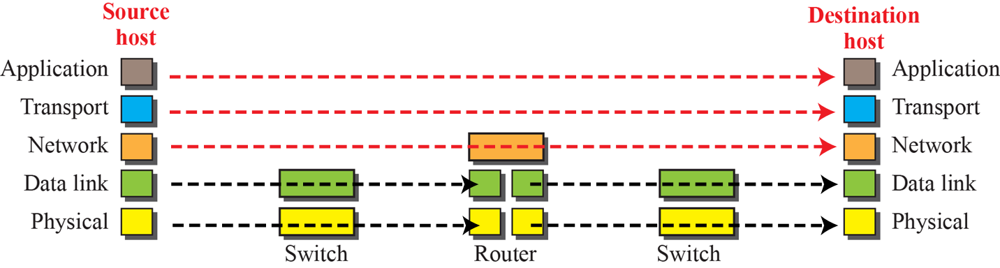
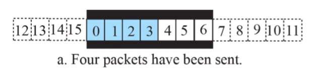
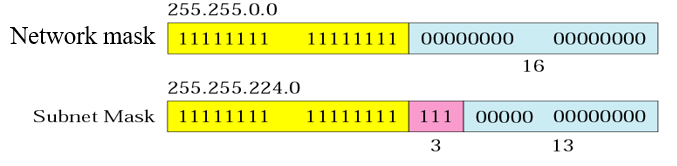

# 계층 구조의 개념

우편 시스템을 생각 해 보자.  
편지를 주고받을 때, 논리적으로는 편지를 받는 사람과 연결되어 있다고 생각할 수 있다.  
그러나 실제로는 직접 전달되는것이 아닌 우체국을 통해 편지가 전달된다.  
편지를 주고받는 사람들은 우편 시스템을 생각해볼 필요 없이, 규칙을 지켜 우체통에 넣기만 하면 전달 한 것이다.  
똑같이 우편배달부도 우체통에서 수거한 편지들을 우체국에 전달만 해 주면 된다.  
한 계층은 맡은 역할만 하고 ,규칙만 지켜 다른 계층으로 넘겨주기만 하면 된다.  
계층끼리는 논리적으로 연결되어 있다.  
편지는 실제로 우편배달부에게 전달 (물리)했지만, 상대방에게 전달(논리)한 것이다.

## 정리

계층간은 서로 독립적이다.

계층간의 약속(Interface)이 지켜져야 한다.

물리적인 연결은 인접 계층과 이루어지고, 논리적인 연결은 상대 노드의 동일 계층(Peer Layer)과 이루어 진다.

# En-/De-Capsulation

## En-Capsulation

하위 계층으로 전달할 때, 받은 Payload에 헤더를 붙여 내려 보낸다.

다시 하위 계층은 받은 Payload에 헤더를 또 붙여 전달.

단지 Peer Layer 로 그대로 보내주기만 하면 된다.

헤더에 필요한 데이터를 추가해 나가는 것.

## De-Capsulation

수신받은 Peer Layer 에서는, 해당 헤더를 제거해 상위 계층으로 올려 보낸다.

다시 상위 계층은 상위 계층으로 전달할 때, 받은 내용에서 헤더를 또 제거하고 전달.

# Application Layer

계층모델의 최상위 계층으로, 다른 application(process)과 통신해 다양한 서비스를 제공한다.

예시) 크롬 브라우저, HTTP 프로토콜을 통해 웹 서비스 제공.

Transport Layer 로 데이터를 내려 보내며, 이를 위한 인터페이스를 제공한다.

일반적으로 process간 통신을 위해서는 Socket 을 사용하게 된다.

Socket 주소는 IP와 Port 로 구성되며, IP는 host 식별을 위해 Network Layer에서, Port는 Porcess 식별을 위해 Transport Layer에서 사용된다.

## Application Layer Protocol

HTTP, FTP, DNS 등이 존재한다.

# Transport Layer

host에서 어느 process 에게 전달을 해줘야 하는지 결정하고 데이터를 검증하는게 Transport Layer의 핵심 책임이다.

어느 Process 에게 전달할지는 Port에 의해 결정된다.

## Flow Control

송신 / 수신 계층에 버퍼를 이용해 Flow Control.

Pushing -> Flow Control 필요.  
Pulling -> Flow Control 불필요.

## Error Control

### Sequence Number

패킷에 번호를 메겨 순서를 검증.  
Modulo 값을 반복한다.

### Acknowledgement

Sender 에게 수신을 알리는 패킷을 보낸다.  
Ack 또한 번호가 필요하다.  
Ack 가 일정 시간내에 오지않으면 재전송하는 등 활용이 가능.

## Sliding Window

Error Control과 Flow Control 의 버퍼를 합친 개념.  

## TCP

TCP 는 신뢰성있는 데이터 전송을 지원하는 연결지향성 프로토콜.  
흐름 제어와 혼잡 제어를 지원하며, 3-Way-HandShaking 을 통해 연결하고 4-Way-HandShaking 을 통해 연결을 끊는다.

연결지향성이므로 순서와 신뢰성을 보장한다.  
HTTP, SMTP, FTP등에 사용된다.

## UDP

UDP는 비연결성 프로토콜.  
흐름제어, 오류제어, 혼잡제어 모두 지원하지 않는다.  
대신 낮은 비용, 낮은 처리 시간의 특징을 갖고있어
신뢰성이 필요 없는 간단한 데이터 전송이나
실시간 데이터 전송 등에 사용된다.

# Network Layer

네트워크에서 패킷의 전송과 라우팅을 담당한다.  
IP 프로토콜을 통해 주로 구현된다.

패킷화 -> 캡슐화와 동일. 받은 페이로드를 목적지(host) 까지 사용, 변경 없이 전달하고 역 캡슐화  
Routing -> 목적지(host) 까지의 최적 경로를 찾게 됨. forwarding table 을 update한다.  
Forwarding -> Forwarding table 을 사용해 패킷 전송.  
주소 체계 -> IP Address  
Node 하나하나 IP Address 보유할 경우 주소가 모자람.  
subnet 방식을 사용.  
서브넷은 나머지 인터넷에서는 단일 네트워크 취급.  
IP Address 구역을 나누어 Network Mask, Subnet Mask, Subnet Address로 볼 수 있다.  
Network Mask 는 Network 주소로 사용되고 Subnet Mask 는 Subnet 식별시 사용된다.  
Subnet Address 는 Subnet 에서 Node 식별에 사용된다.  

