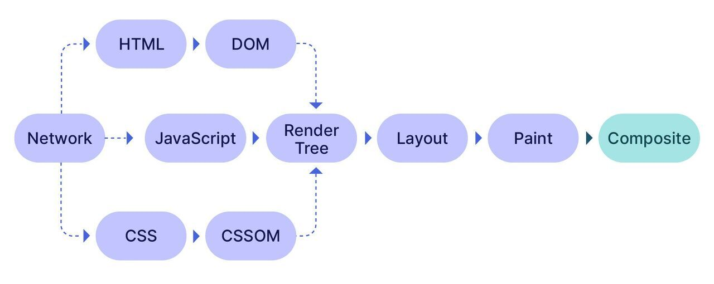
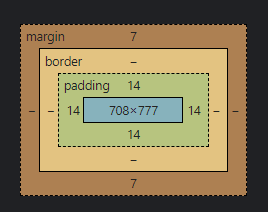

# Critical Rendering Path

브라우저 렌더링 과정을 Critical Rendering Path라 한다.

이 Path에서 어느 일이 일어나는지 한번 확인 해 보자.



1. HTML을 읽고 DOM 트리 생성 (Parse)  
   HTML 파일은 문자열 형태로 저장되어 있다.

   이를 읽어서 DOM Tree로 변환한다.

   ```html
   <html lang="kr">
     <head></head>
     <body>
       <span>Hello World!</span>
     </body>
   </html>
   ```

   즉, 위와같은 Tag들을 객체화시켜 트리 형태로 저장한다는 것이다.

   ```
   html
   ├── head
   └── body
       └── span
   ```

   이런 트리 구조로 저장된다.

   트리의 각 노드에 createElement, setAttribute 등 DOM API 를 제공하기 때문에 프로그래밍 언어에서 접근이나 조작이 가능한 것이다.

   그래서 DOM이 무엇이냐? 한다면 HTML 요소들의 구조화된(객체) 표현이라고 할 수 있다.

2. CSS를 읽고 CSSOM 트리 생성 (Parse)  
   CSS 또한 HTML Parse와 동일하게 진행된다.  
   단 모델을 DOM 이 아닌 CSSOM 을 사용한다.

- HTML 파싱중에 JavaScript를 만나는 경우, 잠시 중단하고 JavaScript를 우선 실행한다.  
  이러한 특성에 따라 다음과 같은 이슈를 만난다.

  1.  스크립트 아래의 DOM 요소 접근 불가능.
  2.  스크립트가 매우 큰 경우 페이지 로딩 지연

  defer 와 async 속성을 살펴 보자.

  - defer  
    스크립트를 백그라운드에서 다운로드.  
    다운로드 중이건 완료했건 파싱을 멈추지 않음.  
    파싱을 완료하고 DOMContentLoaded 이벤트 발생 전에 순차적으로 실행됨.
  - async  
    스크립트를 백그라운드에서 다운로드.  
    다운로드가 끝나면, 다운로드 끝난 순서에 따라 순차적으로 실행됨.  
    실행중에는 파싱을 멈춤.

3. DOM Tree 와 CSSOM Tree를 결합해 Render Tree 생성.  
   DOM Tree는 Html, CSSOM Tree는 CSS를 각각 나타내는 독립적인 객체.  
    화면에 표시하기 위해 이를 합쳐 Render Tree로 만들자.

- 루트에서 각 트리 순회.
- 일부 노드 필터링 (display:none, 스크립트 태그, 메타 태그 등)
- 각 노드에 맞게 CSSOM 규칙 적용.

  위 과정을 거쳐 화면에 표시되는 노드와 스타일 정보를 담고있는 객체들의 트리인 Render Tree 생성.

4. 트리 각 노드의 형태를 결정. (Layout)  
    Render Tree 에서는 스타일 규칙만 적용되어 있음.  
    이 과정에서는 노드의 위치와 크기를 계산하게 됨.

   

   이런 Box Model로 크기와 위치가 계산.  
    위 그림에 표시된 속성 외에도 top, left, right, bottom 속성이 존재.  
    이 과정에서 노드의 속성에 따라 Layer화 시킴.

   - Layer 생성 조건  
      position 관련 속성  
      overflow, alpha 값  
      css filter  
      3D transform, animation  
      canvas, video  
      scrollbar가 존재하는 경우 별도의 layer 생성하여 처리
     같은 z-index의 레이어가 겹치는 경우 별도의 layer 생성하여 처리

   - Graphic Layer 생성 조건  
     css 3d transform이나 perspective 속성 사용 경우  
     css animation 함수나 필터 함수 사용 경우  
     video, canvas 사용 경우  
     자식 요소가 레이어로(UI) 사용된 경우  
     z-index가 낮은 형제 요소가 레이어로 사용된 경우

5. 각 노드를 실제로 그려 화면에 표시. (Composite)
     
   각 노드를 그리고, Layer를 합쳐(Composite) 화면에 표시

각 과정에 따라 주요 이벤트 발생 시점은 다음과 같다.

Processing

- domLoading  
  브라우저가 처음 수신한 HTML 문서 바이트의 파싱을 시작하려고 하는 상태.
- domInteractive  
  브라우저가 파싱을 완료한 시점 즉, DOM이 준비된 상태.
  파서 차단 자바스크립트가 없으면 domInteractive 직후에 DOMContentLoaded 이벤트 발생.
- domContentLoaded  
  DOM이 준비되고 자바스크립트 실행을 차단하는 스타일시트가 없는 상태. 즉, DOM 및 CSSOM이 모두 준비된 상태로 렌더링 트리를 생성할 수 있음.
  많은 자바스크립트 프레임워크가 자체 로직을 실행하기 전에 이 이벤트를 기다립니다.
- domComplete  
  페이지 및 해당 하위의 모든 리소스가 준비된 상태입니다.
  이름이 의미하는 바와 같이, 모든 처리가 완료되고 페이지의 모든 리소스(이미지 등) 다운로드가 완료되었습니다( 예: 로딩 스피너가 회전을 멈춤).

Load

- loadEvent  
  각 페이지 로드의 최종 단계로, 브라우저가 추가 애플리케이션 로직을 트리거할 수 있는 상태로 onload 이벤트를 발생.

Update 시 무슨 작업을 하느냐에 따라 CRP 과정이 달라질 수 있다.

Layout 작업이 새로 이루어지는 속성 변경 -> Layout 과정부터 다시 실행.(top, left, width 등)

Layout 영향 없는 Paint Only 속성 변경 -> Layout 건너뛰고 Paint 과정부터 실행.(color 등)

Layout, Paint 영향 없는 속성 변경 -> Composite 과정부터 실행.

자바스크립트에 의해 DOM 트리, CSSOM 트리가 변경 -> Render Tree 재구성, Reflow와 Repaint가 일어나게 된다.
