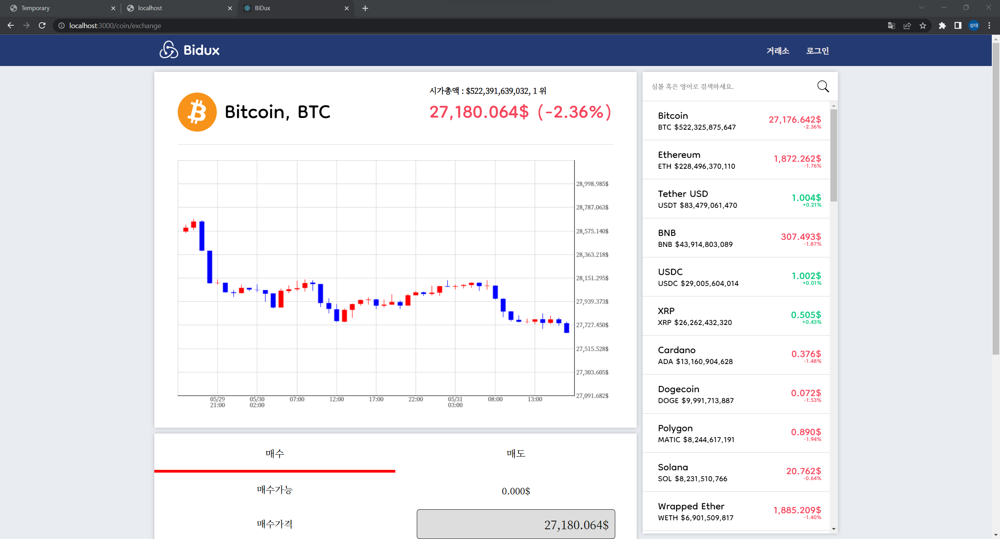

# Project

## 코인

개발기간 : 약 3주

개발환경 : React, Redux

깃허브 : https://github.com/Surplus05/coin  

데모 링크 : https://surplus05.github.io/coin/exchange

설명 : 코인 거래소 페이지를 구현해 봤습니다.  
코인 검색시 InterSection Observer를 통해 무한 스크롤을 구현했습니다.  
차트는 직접 그렸습니다.  
로그인은 Firebase 를 통해 구현했습니다.  
(현재 API 연결이 끊어져 로그인 불가능)

## 화면

## 유튜브 프로젝트

개발기간 : 약 4주

개발환경 :  
React TypeScript Redux Redux-toolkit Styled-Components

깃허브 : https://github.com/Surplus05/react-ts  

데모 링크 : https://surplus05.github.io/react-ts

설명 : TypeScript를 처음 적용했습니다.  
검색창은 미리보기 기능을 지원하는데, Throttle 방식으로 입력의 변화가 일정시간동안 없어야 네트워크 요청이 이루어집니다.  
썸네일은 반응형으로 이루어지며 Device width 에 따라 5~2개의 썸네일이 한 width에 담기게 됩니다.  
마우스로 드래그가 가능합니다.  
썸네일에 마우스를 일정시간 올리고 있거나, 클릭시 바로 동영상 시청이 가능합니다.
같이보기 기능에서 채팅은 실시간이 아니지만 시간에 따라 출력되게 하여 실시간 느낌이 나게 구현했습니다.

## 화면

  
  
## 간단한 게시판 (현재 배포중단)

개발기간 : 약 1주

개발환경 :  
ExpressJs Oracle React TypeScript Redux Redux-toolkit Styled-Components

깃허브 : https://github.com/Surplus05/express-oracle

설명 : 서버리스가 아니라 직접 DB환경을 구축해 봤습니다.  
로그인, 회원가입, 댓글, 게시글 CRUD를 간단하게 구현했습니다.  
구현과 더불어 Restful API, CORS, 배포과정 등 소중한 경험이 되었습니다.

## 화면

## 분양 플랫폼

개발기간 : 약 4주 (4인)

개발환경 :  
NextJS, TypeScript, Recoil, SCSS

깃허브 : https://github.com/adopt-pet-project/Front-End/tree/develop

링크 : https://pet-hub.site/

설명 : 게시글, 분양글, 전반적인 레이아웃, 로그인, 회원가입, 채팅전체, JWT관리, 쪽지발송, Trouble Shooting을 담당했습니다.  
모바일을 염두로 UI를 구성했습니다.  
카카오 지도 API를 사용했습니다.  
뿐만 아니라 EC2와 PM2로 배포하며 S3, CodeDeploy로 배포 CI/CD 환경 또한 구축했습니다.  
노션과 GIT을 통해 협업했습니다.

## 화면

