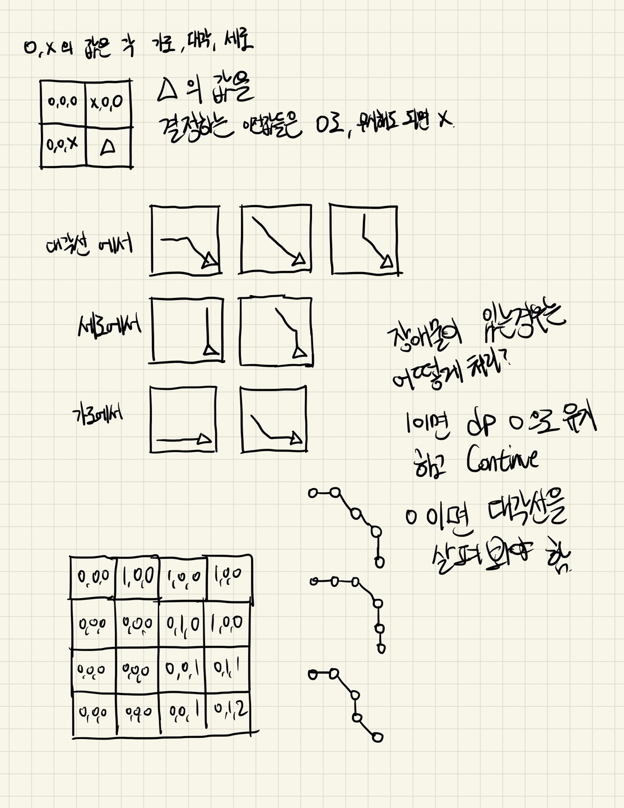

# 17069 파이프 옮기기 2

소요시간 : 약 70분

문제파악 -> 장애물 없이 구현 -> 장애물 조건 파악 -> 장애물 포함 구현

풀긴했는데 좀 오래걸렸다.

파이프 움직이는 조건 자체는 빠르게 파악했으나 장애물 조건을 파악하는데 시간이 조금 더 걸렸고 오히려 구현에서 세세하게 신경 쓸 것이 많아서 오래걸린듯. 3차원 배열은 처음 초기화 해봐서 좀 헤맸다.



```typescript
const path = require("path");
const filePath =
  process.platform === "linux"
    ? "/dev/stdin"
    : path.join(__dirname, "/input.txt");
const input: string[] = require("fs")
  .readFileSync(filePath)
  .toString()
  .trim()
  .split("\n")
  .map((s: string) => s.replace("\r", ""));

let N = parseInt(input[0]);

let house = input.slice(1).map((line) => line.split(" ").map(Number));

let dp: number[][][] = [[[0, 0, 0]]];

let blocked = false;

for (let i = 1; i < N; i++) {
  if (house[0][i] === 1) blocked = true;

  if (blocked) {
    let arr = new Array(3).fill(0);
    dp[0].push(arr);
  } else {
    let arr = new Array(2).fill(0);
    arr.unshift(1);
    dp[0].push(arr);
  }
}

for (let i = 1; i < N; i++) {
  let arr1: number[][] = [];
  for (let j = 0; j < N; j++) {
    let arr2 = new Array(3).fill(0);
    arr1.push(arr2);
  }
  dp.push(arr1);
}

for (let i = 1; i < N; i++) {
  for (let j = 1; j < N; j++) {
    if (house[i][j] === 1) continue;

    if (house[i - 1][j] !== 1 && house[i][j - 1] !== 1)
      dp[i][j][1] =
        dp[i - 1][j - 1][0] + dp[i - 1][j - 1][1] + dp[i - 1][j - 1][2];

    dp[i][j][0] = dp[i][j - 1][0] + dp[i][j - 1][1];
    dp[i][j][2] = dp[i - 1][j][1] + dp[i - 1][j][2];
  }
}

console.log(dp[N - 1][N - 1].reduce((sum, cur) => sum + cur));
```
